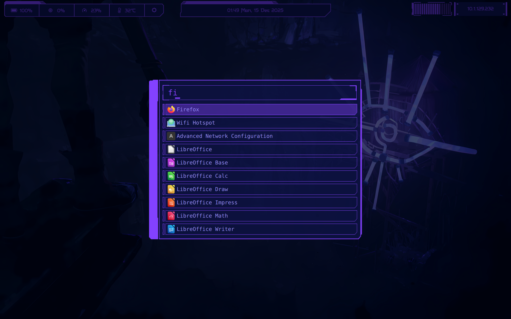

# PunkLauncher

> A fast, keyboard-centric, cyberpunk-themed application launcher for Wayland Compositors.

PunkLauncher is a minimal yet powerful launcher built with **C++** and **Qt 6 / QML**. It prioritizes speed, muscle memory, and aesthetics. It features intelligent window switching, usage-based ranking, and a robust custom icon engine.



## 🛠️ Build Instructions

### Prerequisites
* **C++ Compiler:** GCC or Clang
* **Qt 6:** `qt6-base`, `qt6-declarative`
* **Build System:** qmake6

### Installation
1.  **Clone the repository:**
    ```bash
    git clone https://github.com/bluebottlewize/punk-launcher.git
    cd punk-launcher
    ```

2.  **Build with qmake:**
    ```bash
    mkdir build && cd build

    # Run qmake on the project file
    qmake6 ../punklauncher.pro

    # Compile
    make
    ```

3.  **Run:**
    ```bash
    ./punklauncher
    ```
